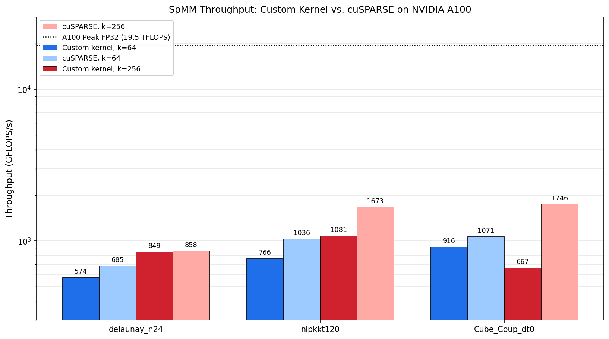

# CUDA SpMM

A high-performance CUDA kernel for **sparse–dense matrix multiplication** (SpMM):

$$
Y \;=\; A \cdot X
$$

where $A$ is a large sparse matrix in CSR format and $X$, $Y$ are tall-skinny dense
matrices with $k$ columns. SpMM is a core kernel in graph neural networks, iterative
solvers, and many other workloads where the same sparse operator is applied to a
batch of dense vectors.

The kernel is tuned for the NVIDIA A100 (SM 80) and benchmarked against
**cuSPARSE** on three representative matrices from the SuiteSparse collection.

## Results at a glance



| Matrix          | $k=64$ custom | $k=64$ cuSPARSE | $k=256$ custom | $k=256$ cuSPARSE |
| --------------- | -------------:| ---------------:| --------------:| ----------------:|
| `delaunay_n24`  | 574           | 685             | 849            | 858              |
| `nlpkkt120`     | 766           | 1036            | 1081           | 1673             |
| `Cube_Coup_dt0` | 916           | 1071            | 667            | 1746             |

*Throughput in GFLOPS/s. Average across all six configurations: **808.8 GFLOPS/s**.*

The custom kernel is competitive with cuSPARSE on graph-like sparsity
(`delaunay_n24`, within 1% at $k = 256$) and falls behind most on the structurally
banded `Cube_Coup_dt0`, where cuSPARSE benefits from L2 reuse that the simple
warp-split-k strategy does not exploit. Both kernels operate well below the A100's
19.5 TFLOPS FP32 peak — SpMM is fundamentally memory-bandwidth-bound, since each
fused multiply-add requires loading a fresh `A` value and an `X` element from
global memory.

## How it works

### Parallelization strategy: block-per-row-group, warps split k

Each thread block has dimensions `(32, k/32)`:

- For $k = 64$: 64 threads = 2 warps.
- For $k = 256$: 256 threads = 8 warps.

Within a block, every warp owns a contiguous 32-column slab of the output, and the
32 lanes inside the warp split that slab one column per thread. Each thread
therefore holds **only a single register accumulator**, regardless of $k$.

```
block (k = 256, 8 warps):
                  output columns 0..255
                  ┌───────────┬───────────┬─── ... ───┬───────────┐
   warps in block │  warp 0   │  warp 1   │           │  warp 7   │
                  │ cols 0-31 │ cols 32-63│           │cols 224-255│
                  └───────────┴───────────┴─── ... ───┴───────────┘
                       ▲ 32 lanes, 1 column each, 1 fp32 accumulator per thread
```

All warps in a block walk the **same set of rows in lockstep**. This has two
consequences:

1. **No register-pressure cliff.** A previous version held 8 register
   accumulators per thread for $k = 256$; collapsing to one accumulator per
   thread restored full occupancy.
2. **L1 reuse on the sparse operands.** The first warp's read of `vals[jj]` and
   `colinds[jj]` brings the cache line into L1; the other warps in the block
   hit L1 for free. Only `X` is read with diverging addresses across warps.

### Row-balanced block assignment

Nonzeros per row vary dramatically across real matrices: ~6 nnz/row on
`delaunay_n24` versus ~59 nnz/row on `Cube_Coup_dt0`. A naive
"one block per row" launch leaves warps idle on sparse rows and saturates them on
dense ones.

A one-time CPU preprocessing pass (cached after the first call) groups consecutive
rows so each block processes roughly a fixed number of nonzeros:

```cpp
size_t target = std::max((size_t)256, nnz / (size_t)(108 * 16));
```

The constant `108` is the A100's SM count and `16` is a small multiplier so there
are enough blocks to fill the device several times over. The grouping is stored
as a `row_group_begin[]` array on the device; the kernel reads `[row0, row1)` for
its block at launch.

### Other optimizations

1. **No `cudaMemset` of `Y`.** The kernel writes `Y` with `=` (not `+=`), so the
   output buffer does not need to be zeroed between iterations. On
   `delaunay_n24` at $k = 256$, this removes ~17 GB of wasted writes per
   benchmark iteration.
2. **`__ldg` on `X`.** All reads of the dense input go through the read-only
   data cache, which is well-suited to the irregular column-index access
   pattern dictated by the sparsity.
3. **Templated kernel + `__launch_bounds__`.** `SpMM_kernel<K>` is templated on
   $K$, with `__launch_bounds__(K)`. This lets `nvcc` fully specialize the inner
   loop, fold the block-shape arithmetic, and tune register allocation per
   $K$. A generic fallback path is kept for non-standard $k$.

### Inner loop

```cpp
for (uint32_t row = row0; row < row1; row++) {
    const uint32_t rs = rowptrs[row];
    const uint32_t re = rowptrs[row + 1];

    float acc = 0.0f;
    for (uint32_t jj = rs; jj < re; jj++) {
        const float    a = __ldg(&vals[jj]);
        const uint32_t c = __ldg(&colinds[jj]);
        acc += a * __ldg(&X[(size_t)c * K_ + k_col]);
    }
    Y[(size_t)row * K_ + k_col] = acc;
}
```

That's the entire compute path: one accumulator, one row at a time, one column
of $Y$ per thread.

## Building and running on Perlmutter

The project targets NVIDIA A100 (SM 80) and uses cuSPARSE both as a correctness
oracle and a performance baseline. It has been tested on Perlmutter at NERSC.

### Dependencies

- CUDA Toolkit 12.x (loaded via `module load cudatoolkit/12.9` on Perlmutter).
- CMake ≥ 3.5.
- A C++20-capable compiler.

### Build

```bash
mkdir build && cd build
cmake ..
make -j
```

This produces `build/test_spmm`, which loads a Matrix Market file, runs a
correctness check against cuSPARSE, and benchmarks both implementations over 100
iterations.

### Get the benchmark matrices

```bash
./get_matrices.sh
```

This downloads three matrices from the [SuiteSparse Matrix Collection](https://sparse.tamu.edu/)
into `matrices/`:

- `nlpkkt120` — KKT system from a nonlinear program.
- `delaunay_n24` — Delaunay triangulation of a random point cloud (graph-like).
- `Cube_Coup_dt0` — structural mechanics, structurally banded.

### Run a single benchmark

```bash
./build/test_spmm matrices/nlpkkt120/nlpkkt120.mtx 256
```

The two arguments are the path to a `.mtx` file and the value of $k$.

### Run the full benchmark on Perlmutter

`run.sh` is a SLURM batch script that runs all six (matrix, $k$) configurations
on a single A100 node:

```bash
sbatch run.sh
```

The submission requests a single GPU on an `hbm40g` node and loads
`cudatoolkit/12.9` automatically. Adjust the `-A` account flag to match your
allocation.

## Project layout

```
.
├── CMakeLists.txt
├── get_matrices.sh          # Downloads benchmark matrices from SuiteSparse
├── run.sh                   # SLURM submission script (Perlmutter)
├── include/
│   ├── spmm.cuh             # The SpMM kernel and host-side launcher
│   ├── CSR.hpp              # CSR matrix class and Matrix Market reader
│   ├── common.h             # CUDA / cuSPARSE error-check macros, common headers
│   ├── colors.h             # Terminal color codes for output
│   └── utils.cuh            # Device buffer utilities, abs() transform via CUB
├── tests/
│   ├── test_spmm.cu         # Correctness check + cuSPARSE-vs-custom benchmark
│   └── test_common.h        # Timing / GFLOPS helpers, dense matrix init
├── matrices/                # Populated by get_matrices.sh
└── docs/
    └── spmm_throughput.png  # Benchmark figure used in this README
```

## Correctness check

`test_spmm` computes the reference result with `cusparseSpMM` (algorithm
`CSR_ALG3`) and compares it elementwise against the custom kernel using a
floating-point error bound based on $|A| \cdot |X|$:

$$
|\Delta Y_{ij}| \;\le\; u \cdot \mathrm{nnz}(\text{row}_i) \cdot (|A| \cdot |X|)_{ij}
$$

where $u$ is the float32 unit roundoff. This is the standard componentwise bound
for inner-product–based matrix multiplication and gives a tight, sparsity-aware
tolerance — much more meaningful than a flat absolute or relative threshold.

## License

No license file is currently included; add one (e.g. MIT or Apache 2.0) before
publishing if you want to permit reuse.
